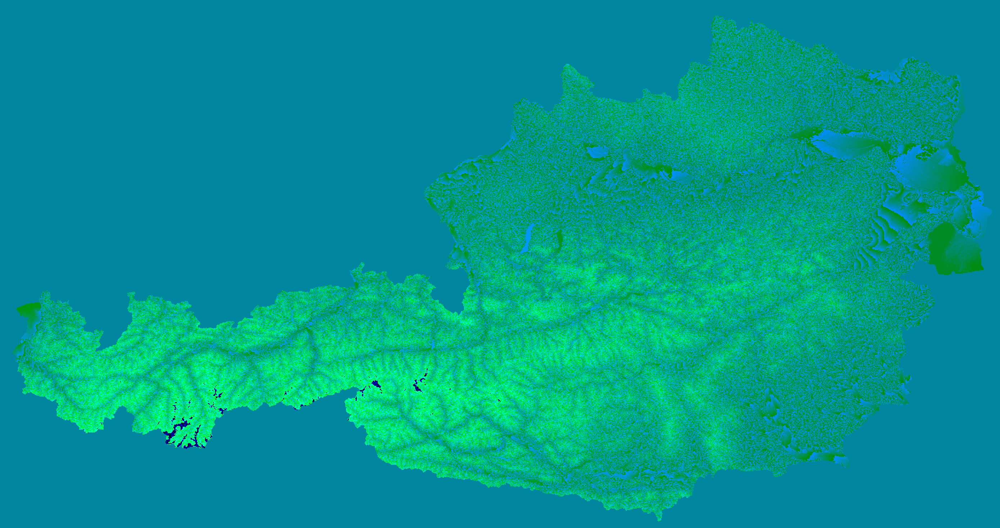

# terrain-rgb
A detailed how-to to convert geo-tiff files containing DEM data into a pyramid of png files

## Motivation

Austria's gonvernment is fully commited to the idea of open data. A huge amount of data is published on [Austria's open data site](https://data.gv.at). This includes geo data like (vector) basemaps, contour lines, hillshading tiles and a lot more. Also Digital Elevation Model (DEM) data is available. The data is published as a (huge!) GeoTIFF file. Although one may convert the file into a _Cloud Optimized GeoTIFF_ (COG), the goal of this how-to is to convert the GeoTIFF into a pyramid of PNG files that are contained in an MBTiles container.

Based on the model of [Mapbox Terrain-RGB](https://docs.mapbox.com/help/troubleshooting/access-elevation-data/) tileset we will document all steps required in order to create a similar set of tiles. This also means that we want our tiles to

1) use the WebMercator/WGS 84/Pseudo-Mercator -- Spherical Mercator projection [EPSG:3857](https://epsg.io/3857)
2) be available in the zoom levels from 0 up to 15

## Tools

The open source world is full of useful tools that provide a bunch of functionality. Thanks to Docker there is no need to install them locally. You can install all of the tool on your machine be we will use docker here. The ```tools```  folder contains a ```Dockerfile``` that can be used to create an image. Well will tag the image with ```rio``` since we make heavy use of Mapbox's [RasterIO](https://rasterio.readthedocs.io/en/latest/).

```shell
  cd tools
  docker create . -t rio
```
Based on the ```osgeo/gdal``` docker image we install ```rasterio``` and a few plugins from the [RasterIO Plugin Registry](https://github.com/mapbox/rasterio/wiki/Rio-plugin-registry).

## Data

Since we mentioned Austria's Open Data initiative we will use the [DEM of Austria with a resolution of 10x10m](https://www.data.gv.at/katalog/dataset/b5de6975-417b-4320-afdb-eb2a9e2a1dbf). All steps below assume that you have downloaded and extracted the GeoTIFF file. As of Feb. 2020, the name of the file containing the data is ```dhm_at_lamb_10m_2018.tif```.

### Inspecting the data

Let's see what we have got so far by starting the container and run rasterio in order to collect some information. We'll start the docker container and mount our folder ```/Users/thomas/Development/geodata/ogd-10m-at``` that contains the GeoTIFF to the folder ```/opt/dem```. ```rio``` is the name of the image (see section #Tools) and we execute the shell ```sh```.

```shell
  docker run --rm -it -v /Users/thomas/Development/geodata/ogd-10m-at:/opt/dem rio bash
```

All commands are now executed inside the container. We change into folder ```/opt/dem``` and execute _rasterio_ to get same basic information:

```shell
  rio info --indent 2 dhm_at_lamb_10m_2018.tif
```

The result gives us detailed insights to the GeoTIFF:

```json
  {
  "blockxsize": 256,
  "blockysize": 256,
  "bounds": [
    108875.0,
    268625.0,
    689485.0,
    586555.0
  ],
  "colorinterp": [
    "gray"
  ],
  "compress": "deflate",
  "count": 1,
  "crs": "PROJCS[\"MGI_Austria_Lambert\",GEOGCS[\"MGI\",DATUM[\"Militar_Geographische_Institute\",SPHEROID[\"Bessel 1841\",6377397.155,299.1528128000033,AUTHORITY[\"EPSG\",\"7004\"]],AUTHORITY[\"EPSG\",\"6312\"]],PRIMEM[\"Greenwich\",0],UNIT[\"degree\",0.0174532925199433],AUTHORITY[\"EPSG\",\"4312\"]],PROJECTION[\"Lambert_Conformal_Conic_2SP\"],PARAMETER[\"standard_parallel_1\",46],PARAMETER[\"standard_parallel_2\",49],PARAMETER[\"latitude_of_origin\",47.5],PARAMETER[\"central_meridian\",13.33333333300013],PARAMETER[\"false_easting\",400000],PARAMETER[\"false_northing\",400000],UNIT[\"metre\",1,AUTHORITY[\"EPSG\",\"9001\"]]]",
  "descriptions": [
    null
  ],
  "driver": "GTiff",
  "dtype": "float32",
  "height": 31793,
  "indexes": [
    1
  ],
  "interleave": "band",
  "lnglat": [
    13.32163861566811,
    47.74771359892457
  ],
  "mask_flags": [
    [
      "nodata"
    ]
  ],
  "nodata": -3.4028234663852886e+38,
  "res": [
    10.0,
    10.0
  ],
  "shape": [
    31793,
    58061
  ],
  "tiled": true,
  "transform": [
    10.0,
    0.0,
    108875.0,
    0.0,
    -10.0,
    586555.0,
    0.0,
    0.0,
    1.0
  ],
  "units": [
    "metre"
  ],
  "width": 58061
}
```

There are some very important informations here:

1) The projection is _MGI\_Austria\_Lambert_ with a _Bessel_ spheroid. This is typical for western european regions since the Lambert projection gives us the least distortions here.
2) The GeoTiff is already tiled with a block size of 256 pixel.
3) The hight is encoded in a ```Float32``` data type.
4) The value used to encode the semantic of _no data available_ is ```-3.4028234663852886e+38```

## Reprojection and resetting the value for _No Data_

Since we want our tiles to use the WebMercator projection EPSG:3857 we have to re-project the GeoTIFF first. To do so we can employ the ```gdalwarp``` command. In order to avoid a second processing step we also reset the value for _No Data_. The original file has a value of ```-3.4028234663852886e+38``` for this, we will set it to ```None```. This is required because we want to map the elevation values from a 32 bit signed float number to 3 unsingned bytes. And ```-3.4028234663852886e+38``` is out of scope for unsigned values.

```shell
  gdalwarp 
    -t_srs EPSG:3857 
    -dstnodata None 
    -co TILED=YES 
    -co COMPRESS=DEFLATE 
    -co BIGTIFF=IF_NEEDED 
    dhm_at_lamb_10m_2018.tif 
    dhm_at_EPSG3857_10m_2018.tif
```

This is going to take a few minutes and after it's done we can call ```rio info``` again:

```json
{
  "blockxsize": 256,
  "blockysize": 256,
  "bounds": [
    1040113.8086787398,
    5821081.891449142,
    1925726.8625255583,
    6305034.650461274
  ],
  "colorinterp": [
    "gray"
  ],
  "compress": "deflate",
  "count": 1,
  "crs": "EPSG:3857",
  "descriptions": [
    null
  ],
  "driver": "GTiff",
  "dtype": "float32",
  "height": 32586,
  "indexes": [
    1
  ],
  "interleave": "band",
  "lnglat": [
    13.321300026030602,
    47.73607122149297
  ],
  "mask_flags": [
    [
      "all_valid"
    ]
  ],
  "nodata": null,
  "res": [
    14.851554625057746,
    14.851554625057746
  ],
  "shape": [
    32586,
    59631
  ],
  "tiled": true,
  "transform": [
    14.851554625057746,
    0.0,
    1040113.8086787398,
    0.0,
    -14.851554625057746,
    6305034.650461274,
    0.0,
    0.0,
    1.0
  ],
  "units": [
    "metre"
  ],
  "width": 59631
}
```

By using [QGIS](https://qgis.org) we can visualize our greyscale data. The areas around Austria are _No Data _ areas.


## RGB-ify
Now let's transform the greyscale data into the RGB data. The formula used to calculate the elevation is

```
  height = -10000 + ((R * 256 * 256 + G * 256 + B) * 0.1)
```

So the ```base value``` is ```-10000``` and the ```interval``` (precision of the output) is ```0.1```.

```shell
  rio rgbify 
    -b -10000 
    -i 0.1
    dhm_at_EPSG3857_10m_2018_None.tif
    dhm_at_EPSG3857_10m_2018_RGB.tif
```

The image below shows the elevation data encoded in RGB values. The _No Data_ area is now at elevation zero.



The artefacts in the alps need to be further examined, most likely they are already in the original data.